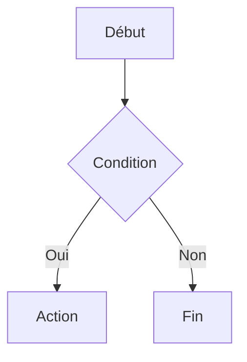
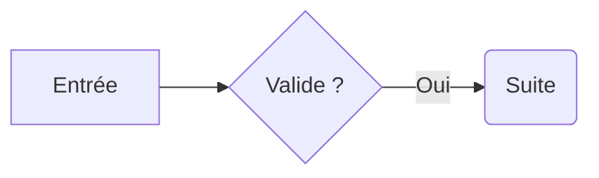

# Flowcharts Markdown

Nodalis peut afficher directement certains diagrammes Mermaid `flowchart` / `graph`
dans l'aperçu Markdown, sans JavaScript, sans dépendance tierce et sans appel réseau.

Le document enregistré reste un fichier Markdown ordinaire. Nodalis ne remplace
jamais le bloc Mermaid par une image ou par un format propriétaire.

## Exemple



Dans l'éditeur, le bouton **Aperçu** permet de basculer entre la source Markdown et
le rendu. Lorsque l'aperçu en direct est activé, modifier le bloc met à jour le
diagramme avec le reste du document.

## Syntaxe supportée

### Déclaration

Le premier contenu du bloc doit être l'une des déclarations suivantes :

- `flowchart TD` ou `flowchart TB` : haut vers bas ;
- `flowchart BT` : bas vers haut ;
- `flowchart LR` : gauche vers droite ;
- `flowchart RL` : droite vers gauche ;
- `graph ...` est accepté comme alias de `flowchart ...`.

Les commentaires Mermaid commençant par `%%` sont ignorés.

### Nœuds

| Syntaxe | Rendu |
| --- | --- |
| `A[Étape]` | rectangle |
| `A(Étape)` | rectangle arrondi |
| `A{Question ?}` | décision en losange |
| `A` | référence à un nœud déjà défini, ou nœud portant le libellé `A` |

Un nœud peut être défini directement dans un lien :



### Liens

La première version prend en charge les flèches dirigées :

```text
A --> B
A -->|Libellé| B
```

Le libellé reste du texte local et n'est jamais interprété comme du HTML actif.

## Constructions non supportées

Nodalis privilégie un sous-ensemble explicite plutôt qu'une émulation partielle de
Mermaid.js. Les constructions telles que `subgraph`, `classDef`, `style`,
les liens pointillés `-.->`, les liens épais `==>`, les liens non dirigés
`---` ou plusieurs flèches chaînées sur une seule ligne sont actuellement
ignorées avec un avertissement.

Une construction non supportée ne modifie pas le Markdown et ne doit pas faire
planter l'aperçu.

Une erreur dans une construction que Nodalis prétend supporter affiche un
diagnostic avec le numéro de ligne et conserve le bloc source visible dans
l'aperçu afin de pouvoir le corriger.

## Navigation dans un grand diagramme

Chaque flowchart dispose de contrôles de zoom de **50 % à 250 %**. La zone de
rendu possède des barres de défilement et peut également être déplacée par
glisser à la souris.

Le rendu utilise uniquement les primitives WPF et les brushes du thème Nodalis ;
il reste donc compatible avec le dark mode et avec le fonctionnement entièrement
hors ligne.
