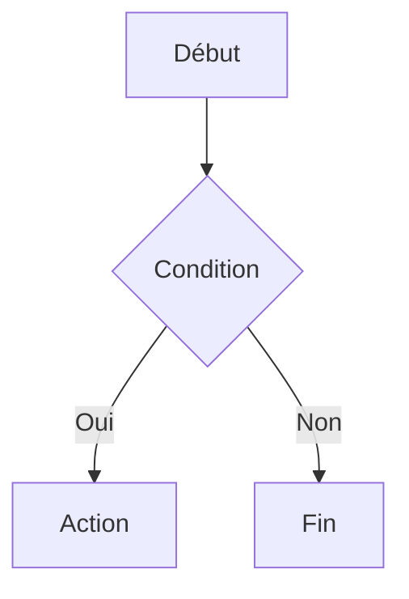
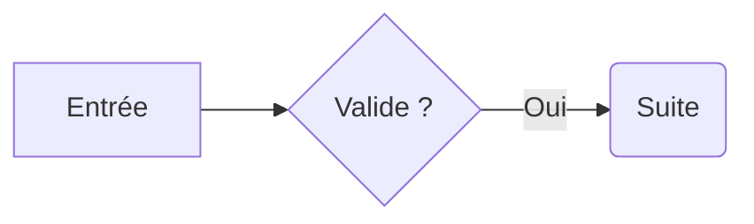

# Flowcharts Markdown

Nodalis peut afficher directement certains diagrammes Mermaid `flowchart` / `graph`
dans l'aperçu Markdown, sans JavaScript, sans dépendance tierce et sans appel réseau.

Le document enregistré reste un fichier Markdown ordinaire. Nodalis ne remplace
jamais le bloc Mermaid par une image ou par un format propriétaire.

## Exemple



Dans l'éditeur, le bouton **Aperçu** permet de basculer entre la source Markdown et
le rendu. Lorsque l'aperçu en direct est activé, modifier le bloc met à jour le
diagramme avec le reste du document.

## Syntaxe supportée

### Déclaration

Le premier contenu du bloc doit être l'une des déclarations suivantes :

- `flowchart TD` ou `flowchart TB` : haut vers bas ;
- `flowchart BT` : bas vers haut ;
- `flowchart LR` : gauche vers droite ;
- `flowchart RL` : droite vers gauche ;
- `graph ...` est accepté comme alias de `flowchart ...`.

Les commentaires Mermaid commençant par `%%` sont ignorés.

### Nœuds

| Syntaxe | Rendu |
| --- | --- |
| `A[Étape]` | rectangle |
| `A(Étape)` | rectangle arrondi |
| `A{Question ?}` | décision en losange |
| `A((Fin))` | cercle |
| `A[(Données)]` | base / cylindre |
| `A[[Sous-processus]]` | sous-processus |
| `A([Début])` | terminal / stadium |
| `A{{Choix}}` | hexagone |
| `A` | référence à un nœud déjà défini, ou nœud portant le libellé `A` |

Les définitions modernes Mermaid sont également reconnues pour les formes
principales, par exemple `A@{ shape: stadium, label: "Début" }`,
`B@{ shape: cylinder, label: "Données" }` et
`C@{ shape: diamond, label: "Valide ?" }`.

Un nœud peut être défini séparément, plusieurs définitions peuvent être séparées
par `;`, et un nœud peut aussi être défini directement dans un lien :



### Liens

Nodalis prend en charge les liens dirigés, les chaînes de liens, les variantes
pointillées/épaisses rendues comme liens dirigés, ainsi que les liens non dirigés :

```text
A --> B
A -->|Libellé| B
A -- Libellé --> B
A --> B --> C
A -.-> B
A ==> B
A --- B
```

Le libellé reste du texte local et n'est jamais interprété comme du HTML actif.

## Constructions non supportées

Nodalis privilégie un sous-ensemble explicite plutôt qu'une émulation partielle de
Mermaid.js. Les classes/styles Mermaid, les interactions `click` et la mise en
page `subgraph` sont actuellement ignorées avec un avertissement. Les nœuds
contenus restent analysés quand leur syntaxe est supportée.

Une construction non supportée ne modifie pas le Markdown et ne doit pas faire
planter l'aperçu.

Une erreur dans une construction que Nodalis prétend supporter affiche un
diagnostic avec le numéro de ligne et conserve le bloc source visible dans
l'aperçu afin de pouvoir le corriger.

## Navigation dans un grand diagramme

Chaque flowchart dispose de contrôles de zoom de **50 % à 250 %**. La zone de
rendu possède des barres de défilement et peut également être déplacée par
glisser à la souris.

Le rendu utilise uniquement les primitives WPF et les brushes du thème Nodalis ;
il reste donc compatible avec le dark mode et avec le fonctionnement entièrement
hors ligne.
